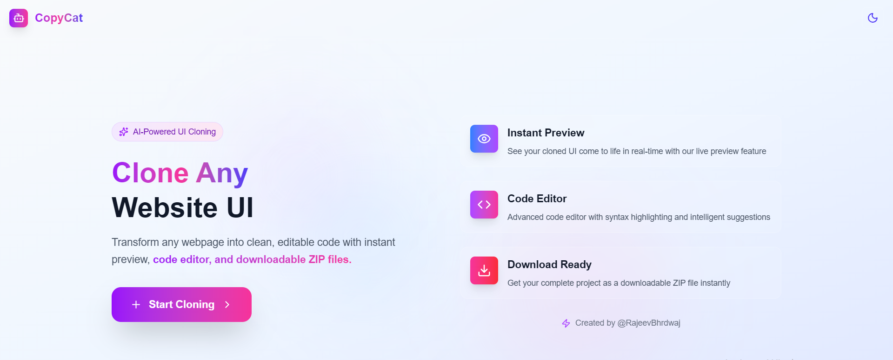
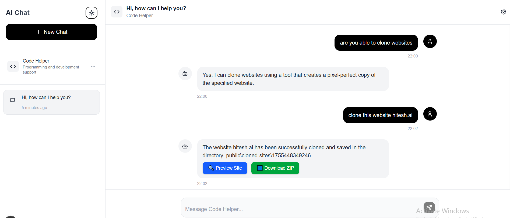
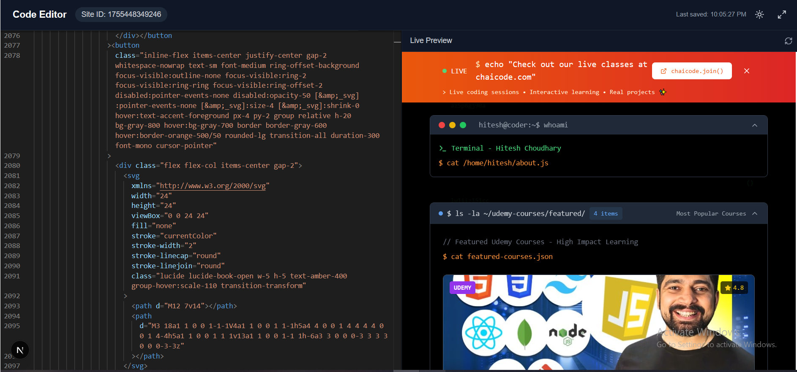

# 🐱 CopyCat – AI-Powered Web Cloner & Prototyping Tool  

<p align="center">
  
</p>

<p align="center">
  
  
  
  
</p>

---

## 🚀 What is CopyCat?  

**CopyCat** is an **AI-powered web cloning & prototyping tool**.  
It allows you to:  

- 🎨 **Clone any website** pixel-to-pixel.  
- ⚡ **Preview & edit live code** inside an editor.  
- 💾 **Download the cloned project as a ZIP**.  
- 🤖 **AI-assisted analysis** for code & structure.  
- 📚 Perfect for **developers, learners, and designers**.  

---

## 📸 Preview  

<p align="center">
  
</p>

<p align="center">
  
</p>

---

## ✨ Features  

✅ Clone **any website** in seconds  
✅ Built-in **Monaco Editor** for code editing  
✅ One-click **ZIP download** of cloned projects  
✅ **Dark/Light mode** support 🌙☀️  
✅ AI-enhanced **code analysis & preview**  
✅ Built with **Next.js + Tailwind + TypeScript**  

---

## 🛠️ Tech Stack  

- ⚛️ **Next.js 13 (App Router)**  
- 🎨 **TailwindCSS**  
- 💻 **Monaco Editor**  
- 🛢️ **MongoDB** (for storing projects)  
- 🔗 **Lucide Icons**  

---

## 📦 Installation  

```bash
# Clone the repo
git clone https://github.com/your-username/copycat.git

# Go into the project
cd copycat

# Install dependencies
npm install

# add .env

MONGODB_URI=mongodb://localhost:27017/copycat
BASE_URL=xxxxxxxxxxxxxxxxxxxxx
MODEL_NAME=gpt-4o-mini
OPENAI_API_KEY= xxxxxxxxxxxxxxxxx

# Start the development server
npm run dev
````

Your app will be live on 👉 `http://localhost:3000`

---

## ⚡ Usage

1. Enter a website URL.
2. CopyCat clones the site into an editable project.
3. Use the **Editor** tab to modify the code.
4. Use the **Preview** tab to see live updates.
5. Click **Download ZIP** to save your project.

---

## 📂 Project Structure

```
copycat/
│── app/                 # Next.js App Router pages
│── components/          # UI components
│── lib/                 # Utils (DB, fetchers, helpers)
│── models/              # MongoDB models
│── public/              # Static assets
│── assets/              # Screenshots (for README)
│── styles/              # Tailwind styles
│── package.json
│── README.md
```

---

## 🤝 Contributing

Contributions are always welcome!

1. Fork the repo 🍴
2. Create your branch (`git checkout -b feature-name`)
3. Commit changes (`git commit -m 'Added feature X'`)
4. Push (`git push origin feature-name`)
5. Open a PR 🚀

---

## 📜 License

MIT License © 2025 \[Rajeev Bhardwaj]

---

<p align="center">
  Made with ❤️ by <b>@CopyCat || Rajeev Bhardwaj</b>  
</p>
```
